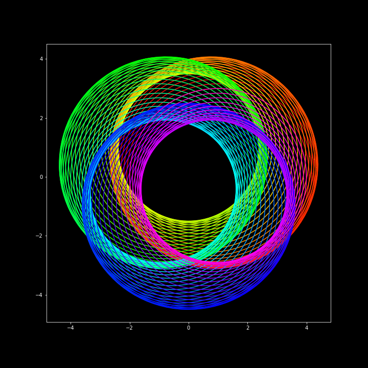

# Introduction

This repository will be a free-form creative outlet for drawing with math and
experimenting with math-y concepts. I've merged three separate repositories
here since I want to combine all my creative (non-deep-learning,
non-data-science) interests in one place.

## [Circles](./Circles.ipynb)

Circles is a library I wrote for drawing ciricles, and seeing what fun I could
have with this by programatically modifying a circle's position on a grid,
adding functionality to modulate / tranlate circle position, radius, etc. One
fun result:

## [Random Walks](./RandomWalks.ipynb)

Random walks are an incredibly cool concept and can be used for all kinds of 
computation - for example, monte-carlo simulation, integration, reinforcement
learning, the list goes on.

In this notebook, I play with different kinds of walks, and visualizing those
walks in a 2D space.

## [Mazes](./Mazes.ipynb)

Mazes and random walks seem to be closely related in my mind. This notebook
explores methods for generating mazes, representing mazes and writing agents
which try to solve mazes

## [Project Euler](./ProjectEuler.ipynb)

Project Euler is a repository of solved math problems that increasingly get
more difficult and interconnected as you progress through. A long time ago, I
solved a few problems in C++, but these days I'm working in python all the
time. This used to be a separate repository, but I feel like it fits the bill
for this repository, so I merged it.
